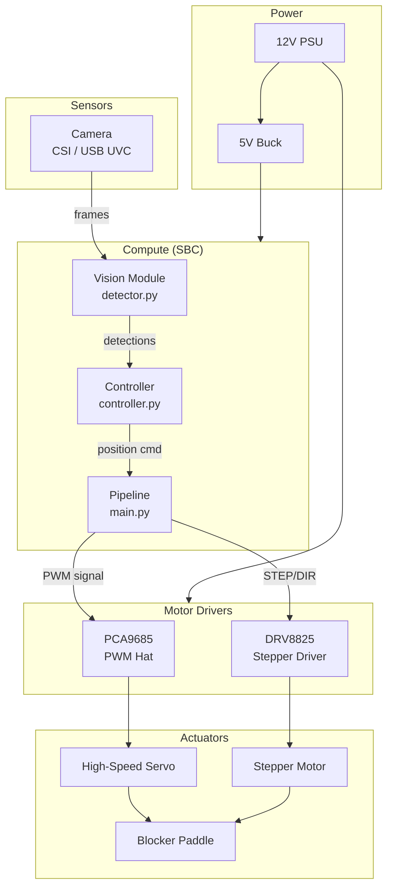
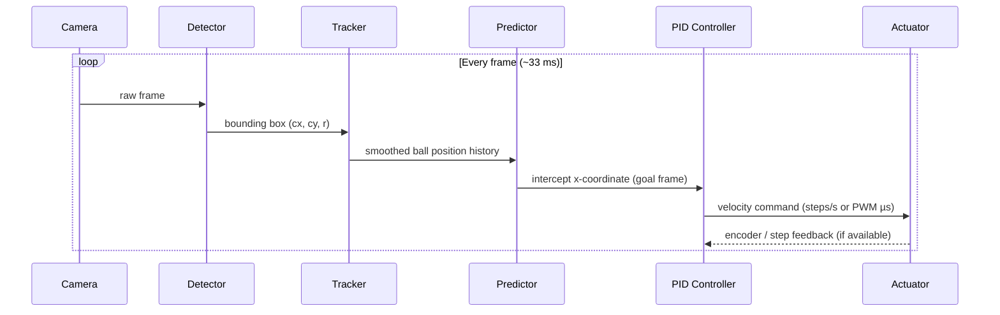

# System Architecture

## Overview

Aqua Keeper AI is structured as a real-time perception-action loop running on an embedded single-board computer (Raspberry Pi 4 or Jetson Nano). All major subsystems are shown below.

---

## Subsystem Map



---

## Control Loop



---

## Latency Budget

| Stage | Target | Notes |
|-------|--------|-------|
| Camera capture | 5 ms | V4L2 buffer, low-latency mode |
| Pre-processing | 2 ms | Resize + normalise |
| Inference | 20 ms | YOLOv8n NCNN on Pi 4 @ 640px |
| Tracking + prediction | 2 ms | NumPy operations |
| PID + command | 1 ms | Pure Python |
| Serial / I²C to driver | 2 ms | PCA9685 I²C @ 400 kHz |
| Mechanical latency | ~40 ms | Servo slew to target |
| **Total** | **< 80 ms** | Budget for a 10 m/s ball |

---

## Coordinate Frames

```
World frame (goal face):
  Origin: left post, bottom corner
  X-axis: right → (0 … goal_width metres)
  Y-axis: up ↑  (0 … goal_height metres)
  Z-axis: out of goal (towards camera, 0 … ~2 m)

Image frame:
  Origin: top-left pixel
  u-axis: right (pixels)
  v-axis: down  (pixels)

Blocker frame:
  Origin: physical left end-stop
  B-axis: right (0 … max_steps or 0.0 … 1.0 normalised)
```

The homography `H` maps `(u, v)` → `(X, Y)` in the goal frame.  
`calibration.py` computes `H` from user-selected goal-corner correspondences.

---

## Failure Modes and Recovery

| Failure | Detection | Recovery |
|---------|-----------|----------|
| Camera disconnected | `VideoCapture.isOpened()` returns False | Log error, retry every 2 s |
| Inference timeout (> 100 ms) | Thread watchdog timer | Skip frame, continue |
| Ball lost (no detection for N frames) | Track loss counter | Hold last intercept position |
| Motor driver fault | GPIO fault pin (DRV8825 `!FAULT`) | Disable drive, log, alert |
| Software e-stop (GPIO 26 LOW) | Interrupt-driven GPIO callback | Immediate motor disable |
| Pi thermal throttle | `vcgencmd measure_temp` | Reduce FPS, log warning |
| Blocker at mechanical limit | Encoder / current spike | Reverse and halt |
