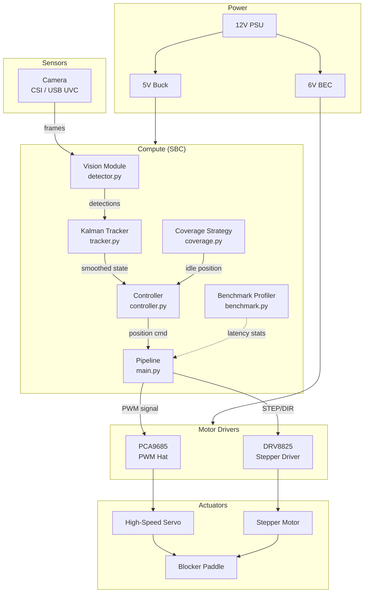
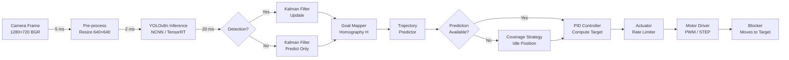
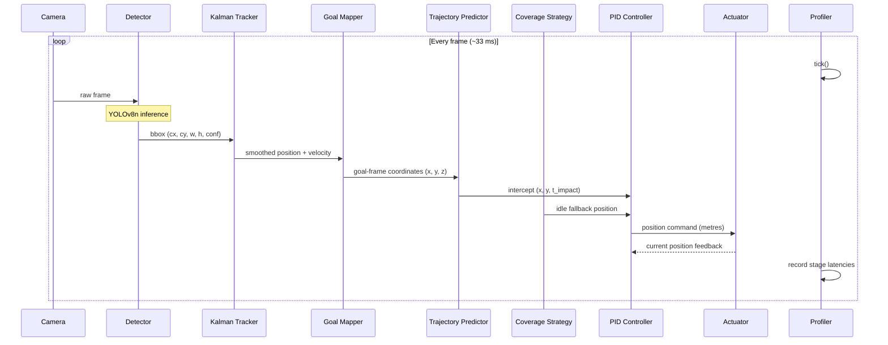
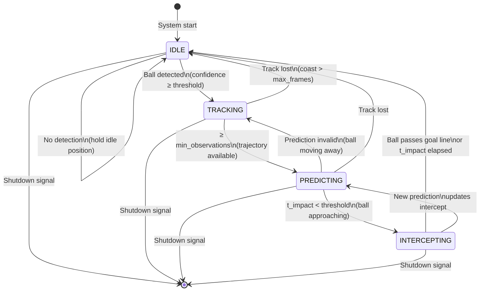
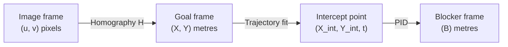
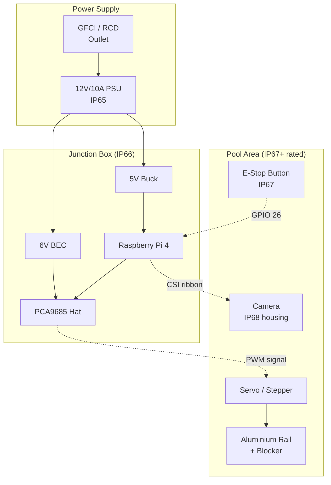

# System Architecture

## Overview

Aqua Keeper AI is structured as a real-time perception-action loop running on an embedded single-board computer (Raspberry Pi 4 or Jetson Nano). The system detects incoming water polo balls via computer vision, predicts their trajectory using Kalman filtering and linear/parabolic models, and drives a motorised blocker to intercept them — all within a target latency budget of **< 80 ms** end-to-end.

---

## Table of Contents

1. [Subsystem Map](#subsystem-map)
2. [Data Flow Pipeline](#data-flow-pipeline)
3. [Control Loop](#control-loop)
4. [State Machine](#state-machine)
5. [Zone Coverage Model](#zone-coverage-model)
6. [Latency Budget](#latency-budget)
7. [Coordinate Frames](#coordinate-frames)
8. [Deployment Architecture](#deployment-architecture)
9. [Failure Modes and Recovery](#failure-modes-and-recovery)

---

## Subsystem Map



---

## Data Flow Pipeline



---

## Control Loop



---

## State Machine

The pipeline operates as a finite state machine with four states:



| State | Blocker Behaviour | LED/Log |
|---|---|---|
| **IDLE** | Hold minimax coverage position (goal centre) | Green |
| **TRACKING** | Follow raw detection, slow response | Yellow |
| **PREDICTING** | Move toward predicted intercept | Orange |
| **INTERCEPTING** | Full-speed move to intercept point | Red |

---

## Zone Coverage Model

The goal face is divided into a configurable grid of zones (default: 5 columns × 3 rows = 15 zones). The coverage strategy computes the minimax-optimal idle position that minimises the worst-case travel time to any zone centre.

```
Goal face (2.4 m × 0.9 m):

┌──────┬──────┬──────┬──────┬──────┐  ← 0.9 m (top bar)
│ R2C0 │ R2C1 │ R2C2 │ R2C3 │ R2C4 │
├──────┼──────┼──────┼──────┼──────┤  ← 0.6 m
│ R1C0 │ R1C1 │ R1C2 │ R1C3 │ R1C4 │
├──────┼──────┼──────┼──────┼──────┤  ← 0.3 m
│ R0C0 │ R0C1 │ R0C2 │ R0C3 │ R0C4 │
└──────┴──────┴──────┴──────┴──────┘  ← 0.0 m (water line)
0.0    0.48   0.96   1.44   1.92   2.4 m
              ^--- idle position (1.2 m)
```

From the idle position at 1.2 m, worst-case reach to zone R0C0 or R0C4 corner centres:
- Distance: ~0.96 m
- At 4.0 m/s: ~240 ms
- At 8.0 m/s (fast servo): ~120 ms

---

## Latency Budget

| Stage | Target | Notes |
|-------|--------|-------|
| Camera capture | 5 ms | V4L2 buffer, low-latency mode |
| Pre-processing | 2 ms | Resize + normalise |
| Inference | 20 ms | YOLOv8n NCNN on Pi 4 @ 640px |
| Kalman filter | 0.5 ms | 6-state matrix operations |
| Homography transform | 0.2 ms | Single `perspectiveTransform` call |
| Trajectory prediction | 1 ms | `polyfit` on ≤ 10 observations |
| PID + coverage | 0.3 ms | Pure Python arithmetic |
| Serial / I²C to driver | 2 ms | PCA9685 I²C @ 400 kHz |
| Mechanical latency | ~40 ms | Servo slew to target |
| **Total** | **< 80 ms** | Budget for a 10 m/s ball |

> Use `src/utils/benchmark.py` (LatencyProfiler) to measure real per-stage latencies during operation.

---

## Coordinate Frames

```
World frame (goal face):
  Origin: left post, bottom corner
  X-axis: right → (0 … goal_width metres)
  Y-axis: up ↑  (0 … goal_height metres)
  Z-axis: out of goal (towards camera, 0 … ~2 m)

Image frame:
  Origin: top-left pixel
  u-axis: right (pixels)
  v-axis: down  (pixels)

Kalman state:
  [x_px, y_px, vx_px/s, vy_px/s, ax_px/s², ay_px/s²]

Blocker frame:
  Origin: physical left end-stop
  B-axis: right (0 … goal_width metres)
```

### Coordinate Transforms



The homography `H` maps `(u, v)` → `(X, Y)` in the goal frame.  
`calibration.py` computes `H` from user-selected goal-corner correspondences.

---

## Deployment Architecture



---

## Failure Modes and Recovery

| Failure | Detection | Recovery | Severity |
|---------|-----------|----------|----------|
| Camera disconnected | `VideoCapture.isOpened()` returns False | Log error, retry every 2 s | High |
| Inference timeout (> 100 ms) | Thread watchdog timer | Skip frame, continue | Medium |
| Ball lost (no detection for N frames) | Kalman coast counter > max | Hold idle coverage position | Low |
| Motor driver fault | GPIO fault pin (DRV8825 `!FAULT`) | Disable drive, log, alert | High |
| Hardware e-stop (GPIO 26 LOW) | Interrupt-driven GPIO callback | Immediate motor disable | Critical |
| Pi thermal throttle | `vcgencmd measure_temp` | Reduce FPS, log warning | Medium |
| Blocker at mechanical limit | Software position clamp | Hold at limit, log warning | Low |
| Config file missing | `FileNotFoundError` on load | Use built-in defaults | Low |
| Model weights missing | `FileNotFoundError` on load | Run without detection, log error | High |
